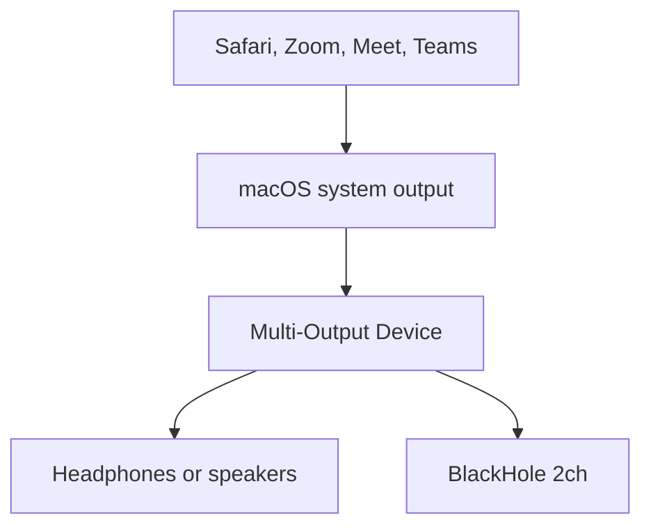
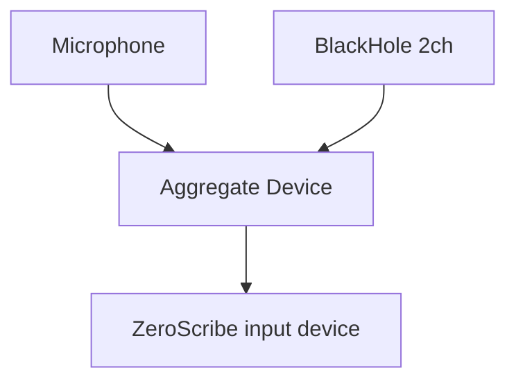
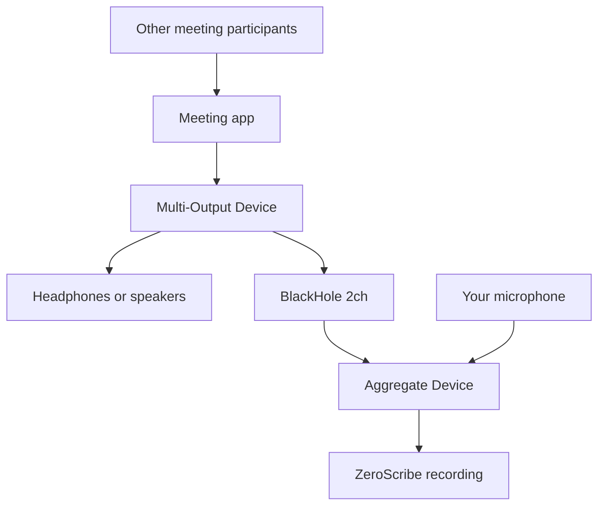

# BlackHole Setup for System Audio Capture

This guide explains how to route macOS system audio into ZeroScribe using BlackHole.

ZeroScribe currently targets Apple Silicon Macs. BlackHole is a macOS virtual audio driver, so this guide does not cover Windows. A Windows version of ZeroScribe would need a different virtual audio cable or loopback setup.

## What BlackHole Adds

macOS does not expose app or meeting audio as a normal microphone input. BlackHole creates a virtual audio device that can receive system audio and appear as an input device to tools like `sounddevice`.

For ZeroScribe, that means BlackHole can eventually support meeting capture where the transcript includes audio coming from the computer, not only the built-in microphone.

## Support The Project

BlackHole is an open source project. The official download page may ask for an optional donation before download. If you can support the creator, do. If not, the download path should still be available.

Official links:

- BlackHole website: https://existential.audio/blackhole/
- BlackHole support page: https://existential.audio/blackhole/support/
- BlackHole GitHub repository: https://github.com/ExistentialAudio/BlackHole

As of May 6, 2026, the website download flow may temporarily point users to a pinned download link in the BlackHole Discord because the email link flow is being affected by bots. Treat that as a temporary distribution note and prefer the current instructions on the official BlackHole website over third-party mirrors.

## Install BlackHole

For ZeroScribe, start with the 2-channel version. It is enough for basic system-audio routing.

### Option 1: Homebrew

```bash
brew install blackhole-2ch
```

Other official Homebrew variants exist for more complex routing:

```bash
brew install blackhole-16ch
brew install blackhole-64ch
```

Use those only if you know you need more channels. ZeroScribe's current recorder captures mono audio, so more channels are not useful yet.

### Option 2: Official Installer

1. Go to https://existential.audio/blackhole/.
2. Use the current official download flow.
3. Close running audio applications.
4. Install the package.
5. Restart the Mac if prompted.

If BlackHole does not appear after installation, restart audio apps first, then restart the Mac.

## Verify ZeroScribe Can See BlackHole

Run:

```bash
python main.py list-devices
```

Look for a device named something like `BlackHole 2ch`.

Use the printed device index with `--device`. For example, if the printed index is `5`:

```bash
python main.py record --duration 5 --device 5
```

The number is the PortAudio device index shown by ZeroScribe, not a 0-based row number.

## Why Multi-Output And Aggregate Devices Are Both Needed

BlackHole, Multi-Output Devices, and Aggregate Devices solve different parts of the meeting-capture problem.

The Multi-Output Device sends computer audio to two destinations at once:



This is why the Multi-Output Device matters. If macOS sends audio only to BlackHole, ZeroScribe can capture the meeting audio, but the user may not hear it. If macOS sends audio only to headphones or speakers, the user can hear the meeting, but ZeroScribe cannot capture that system audio.

The Aggregate Device combines input sources into one selectable input device:



For meetings, the complete flow is:



The short version:

- Multi-Output Device duplicates system audio so the user can hear it and BlackHole can receive it.
- BlackHole carries system audio as a virtual input.
- Aggregate Device combines BlackHole and the microphone into one input device.
- ZeroScribe records the Aggregate Device.

For best results, treat headphones as the listening device, not automatically as the microphone. Many headphone microphones, especially Bluetooth headset microphones, can sound thin, distant, compressed, or heavily noise-processed. A better meeting setup is often:

- Multi-Output Device: headphones plus `BlackHole 2ch`.
- Aggregate Device: MacBook microphone, iPhone microphone, USB microphone, or another good input plus `BlackHole 2ch`.

In other words, headphones can prevent speaker audio from bleeding into the mic, while a separate microphone captures the user's voice.

## Route System Audio Only

This records audio coming from the Mac, such as meeting audio, browser audio, or media playback. It does not include the microphone unless another app routes the microphone into BlackHole.

1. Open `Audio MIDI Setup` on macOS.
2. Click the `+` button and choose `Create Multi-Output Device`.
3. In the Multi-Output Device, enable:
   - Your listening device, such as MacBook speakers, headphones, or an audio interface.
   - `BlackHole 2ch`.
4. Set the Multi-Output Device as the Mac's sound output.
5. Play audio from the app you want to capture.
6. Run:

```bash
python main.py list-devices
python main.py record --duration 30 --device <blackhole-index>
```

If the recording is silent, confirm that the Mac output is the Multi-Output Device and that audio is actively playing while ZeroScribe records.

## Microphone Plus System Audio

This is the meeting-notes target.

1. Create the Multi-Output Device described above.
2. Create an Aggregate Device in `Audio MIDI Setup`.
3. Enable:
   - Your microphone.
   - `BlackHole 2ch`.
4. Run:

```bash
python main.py list-devices
```

Look for the Aggregate Device, then record with its printed device index:

```bash
python main.py record --duration 30 --device <aggregate-device-index>
```

### Current ZeroScribe Behavior

Aggregate Devices often expose multiple channels, for example one channel for microphone audio and one or more channels for BlackHole audio.

ZeroScribe can record all input channels from the selected device. By default it writes a simple preview recording for the existing single-file transcription path. With `--save-stems`, it also writes separate mic/system WAV files that can become the input to a future dual-stem transcription pipeline.

## Troubleshooting

If BlackHole does not appear in `list-devices`:

- Restart audio applications.
- Restart the Mac if needed.
- Re-run `python main.py list-devices`.
- Confirm BlackHole is installed from the official website, GitHub release, or Homebrew package.

If you cannot hear audio while recording:

- Use a Multi-Output Device that includes both BlackHole and your speakers or headphones.
- Confirm the Multi-Output Device is selected as the Mac system output.

If the ZeroScribe recording is silent:

- Confirm the `--device` value is the BlackHole index printed by `list-devices`.
- Confirm audio is playing during the recording window.
- Confirm the app's output is going to the Mac system output or directly to BlackHole.

If microphone speech is missing:

- Confirm you are recording the Aggregate Device, not `BlackHole 2ch` directly.
- Confirm the Aggregate Device includes both the microphone and `BlackHole 2ch`.
- Run with `--save-stems` and inspect the separate `*_mic.wav` and `*_system.wav` files.

If the user's voice sounds distant, muffled, or like it is in another room:

- Confirm which microphone is the first input in the Aggregate Device.
- Avoid using a poor headphone or Bluetooth headset microphone as the main mic if the MacBook, iPhone, or a USB microphone sounds better.
- Use headphones for listening, but keep a better microphone in the Aggregate Device for speech capture.
- Test the microphone by recording it alone before testing the full Aggregate Device.
- Run with `--save-stems` to write separate mic and system WAV files next to the preview recording:

```bash
python main.py record --duration 10 --device <aggregate-device-index> --save-stems
```

Listen to `*_mic.wav` first. If that file is already quiet or muffled, the problem is the mic source or aggregate channel order, not the preview mix.

## Windows

BlackHole is for macOS. ZeroScribe is also currently designed around Apple Silicon and MLX Whisper, so Windows setup is out of scope for the first prototype.

If ZeroScribe is ported to Windows later, it should document a Windows-specific virtual audio cable or loopback driver instead of pretending BlackHole applies there.

## Privacy And Consent

System audio capture can record other meeting participants, media playback, and notification sounds. Get consent where required, and remember that generated `.wav`, transcript, and note files can contain private content.
